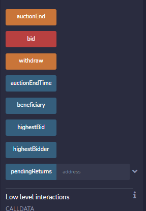

# Simple_Auction

I created this simple auction to demostrate how you can use the auction to bid for numerous applications. You just have to customize the front end features to suit your needs.

In this simple auction, it has multiple characteristics that are useful in this Auction.

 

  Auction end feature shows if the Auction is still going or if it has ended  

  bid feature allows a user to bid a certain amount during the auction. If the bid is less than the highest bid, there will be an error  

  withdraw feature allows a user to withdraw their bid if they were out bid 

  auctionEndTime states how much remaining time is left for the auction  

  beneficiary shows who started the auction  

  highestBid feature shows the highest bid amount  

  highestBidder feature shows the highest bidder and their address  

  pendingReturns allows a user to see if they were outbid and how much they can withdraw from the auction  

